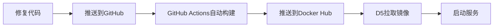

# N8控制中心 - 完整部署指南（修复版）

**版本**: v2.0.1-fixed  
**日期**: 2025-12-11  
**状态**: 已修复metadata字段问题和Agent日志问题

---

## 📊 问题总结

### 1. D5前端未更新问题

**根本原因**：
- REST API容器因`metadata`字段验证失败退出（退出码127）
- 数据库模型使用`meta_data`，Pydantic模型期望`metadata`
- 前端容器找不到后端服务，不断重启

**已修复**：
- ✅ 添加Field别名映射：`metadata: dict = Field(alias="meta_data")`
- ✅ 手动构建API响应，确保字段正确映射
- ✅ 版本号更新为v2.0.1-fixed

### 2. Agent日志爆盘问题

**发现**：
- M3: Agent进程占用303.6% CPU，磁盘100%满
- VPS1: Agent进程占用83.6% CPU（警告级别）
- C1650-1: 未安装Agent（安全）

**已修复**：
- ✅ 添加日志轮转（RotatingFileHandler，最大10MB，保留3个备份）
- ✅ 心跳间隔从5秒改为30秒
- ✅ 指数退避重试策略
- ✅ 命令输出限制10000字符
- ✅ 命令超时5分钟

---

## 🚀 部署方案：GitHub Actions + Docker Hub

### 方案优势

1. ✅ **自动化构建**：代码提交后自动构建镜像
2. ✅ **跨平台支持**：同时构建AMD64和ARM64镜像
3. ✅ **安全可靠**：使用GitHub Secrets管理密钥
4. ✅ **快速部署**：D5直接从Docker Hub拉取
5. ✅ **版本管理**：支持多个版本标签

### 部署流程



---

## 📋 步骤1：准备GitHub仓库

### 1.1 创建仓库

建议使用现有的agent6仓库或创建新仓库：
- **推荐仓库**: `https://github.com/celebrityfeet2020-stack/n8-control-center`
- **或使用**: `https://github.com/celebrityfeet2020-stack/agent6`（复用现有）

### 1.2 配置GitHub Secrets

进入仓库 → Settings → Secrets and variables → Actions → New repository secret

添加两个Secret：
- **`DOCKERHUB_USERNAME`**: `junpeng999`
- **`DOCKERHUB_TOKEN`**: `<your_docker_hub_token>`

### 1.3 上传代码

将以下文件上传到仓库：

```
n8-control-center/
├── .github/
│   └── workflows/
│       └── build-n8-images.yml  # GitHub Actions配置
├── backend/
│   ├── rest_api_secured.py      # 修复后的REST API
│   ├── grpc_server_secured.py   # gRPC Server
│   ├── models_merged.py         # 数据库模型
│   ├── auth.py                  # 认证模块
│   ├── init_db.py               # 数据库初始化
│   ├── device_control_pb2.py    # gRPC协议
│   ├── device_control_pb2_grpc.py
│   ├── requirements.txt         # Python依赖
│   ├── Dockerfile.api-secured   # REST API Dockerfile
│   ├── Dockerfile.grpc-secured  # gRPC Server Dockerfile
│   └── Dockerfile.init          # DB初始化 Dockerfile
├── frontend/
│   └── Dockerfile               # 前端Dockerfile（如果需要）
├── docker-compose.yml           # Docker Compose配置
└── README.md                    # 项目说明
```

---

## 📋 步骤2：触发构建

### 2.1 自动触发

推送代码到main分支：
```bash
git add .
git commit -m "修复metadata字段问题和Agent日志问题"
git push origin main
```

### 2.2 手动触发

进入GitHub仓库 → Actions → Build and Push N8 Control Center Docker Images → Run workflow

### 2.3 查看构建进度

- 进入Actions标签页
- 点击最新的workflow运行
- 查看各个job的执行情况

**预计时间**：10-15分钟

---

## 📋 步骤3：在D5上部署

### 3.1 准备docker-compose.yml

```yaml
version: '3.8'

services:
  # PostgreSQL数据库
  db:
    image: postgres:15-alpine
    container_name: n8-postgres
    environment:
      POSTGRES_USER: n8_user
      POSTGRES_PASSWORD: n8_secure_password_2024
      POSTGRES_DB: n8_control
    volumes:
      - postgres_data:/var/lib/postgresql/data
    ports:
      - "14034:5432"
    healthcheck:
      test: ["CMD-SHELL", "pg_isready -U n8_user"]
      interval: 10s
      timeout: 5s
      retries: 5
    restart: unless-stopped

  # 数据库初始化
  db-init:
    image: junpeng999/n8-db-init:latest-fixed
    container_name: n8-db-init
    environment:
      DATABASE_URL: postgresql://n8_user:n8_secure_password_2024@db:5432/n8_control
    depends_on:
      db:
        condition: service_healthy
    restart: "no"

  # gRPC Server
  grpc-server:
    image: junpeng999/n8-grpc-server:latest-fixed
    container_name: n8-grpc-server
    environment:
      DATABASE_URL: postgresql://n8_user:n8_secure_password_2024@db:5432/n8_control
      GRPC_PORT: 50051
      AGENT_PSK: n8-super-secret-key-2024
      HEARTBEAT_INTERVAL: 30
      DEVICE_TIMEOUT: 120
    ports:
      - "14033:50051"
    depends_on:
      db-init:
        condition: service_completed_successfully
    restart: unless-stopped

  # REST API
  rest-api:
    image: junpeng999/n8-rest-api:latest-fixed
    container_name: n8-rest-api
    environment:
      DATABASE_URL: postgresql://n8_user:n8_secure_password_2024@db:5432/n8_control
      API_PORT: 8080
      GRPC_SERVER_ADDRESS: grpc-server:50051
    ports:
      - "14032:8080"
    depends_on:
      - grpc-server
    restart: unless-stopped

  # Web前端
  frontend:
    image: junpeng999/n8-web:latest-fixed
    container_name: n8-frontend
    environment:
      API_URL: http://rest-api:8080
    ports:
      - "14031:80"
    depends_on:
      - rest-api
    restart: unless-stopped

volumes:
  postgres_data:
```

### 3.2 部署命令

```bash
# 1. SSH到D5
ssh double5090@192.168.9.113

# 2. 创建部署目录
mkdir -p /home/double5090/n8_control_center
cd /home/double5090/n8_control_center

# 3. 下载docker-compose.yml
# （将上面的配置保存为docker-compose.yml）

# 4. 停止旧服务
sudo docker stop control_center-frontend-1 control_center-n8-rest-api-1 control_center-grpc-server-1 control_center-db-1 2>/dev/null || true
sudo docker rm control_center-frontend-1 control_center-n8-rest-api-1 control_center-grpc-server-1 control_center-db-init-1 control_center-db-1 2>/dev/null || true

# 5. 拉取最新镜像
sudo docker-compose pull

# 6. 启动服务
sudo docker-compose up -d

# 7. 查看状态
sudo docker-compose ps

# 8. 查看日志
sudo docker-compose logs -f
```

### 3.3 验证部署

```bash
# 检查数据库
sudo docker exec n8-postgres pg_isready -U n8_user

# 检查REST API
curl http://localhost:14032/health

# 检查前端
curl http://localhost:14031

# 检查所有容器
sudo docker ps --filter "name=n8-"
```

**访问地址**：
- Web前端: http://192.168.9.113:14031
- REST API: http://192.168.9.113:14032
- gRPC Server: 192.168.9.113:14033

---

## 📋 步骤4：修复VPS1的Agent

### 4.1 停止旧Agent

```bash
# SSH到VPS1
ssh ubuntu@43.160.207.239

# 停止旧Agent
sudo pkill -f "/opt/n8-agent/venv/bin/python /opt/n8-agent/agent.py"
```

### 4.2 部署修复版本

```bash
# 备份旧配置
sudo cp -r /opt/n8-agent /opt/n8-agent.backup.$(date +%Y%m%d_%H%M%S)

# 下载修复版本
cd /tmp
wget -O grpc_agent_fixed.py "https://files.manuscdn.com/user_upload_by_module/session_file/310519663232702892/AGENT_URL_PLACEHOLDER"

# 部署
sudo cp grpc_agent_fixed.py /opt/n8-agent/agent.py
sudo chmod +x /opt/n8-agent/agent.py

# 清理旧日志
sudo truncate -s 0 /var/log/n8-agent.log
sudo truncate -s 0 /var/log/n8-agent.err

# 启动新Agent
cd /opt/n8-agent
nohup sudo ./venv/bin/python agent.py > /dev/null 2>&1 &
```

### 4.3 验证

```bash
# 查看进程
ps aux | grep "/opt/n8-agent/agent.py" | grep -v grep

# 查看日志
sudo tail -f /var/log/n8-agent.log

# 检查CPU占用（应该降到10%以下）
top -p $(pgrep -f n8-agent)
```

---

## 📋 步骤5：M3处理（由您手动处理）

### 建议步骤

1. **清理磁盘**：
   ```bash
   # 查找大文件
   sudo find /Users/kori -type f -size +1G 2>/dev/null
   
   # 清理缓存
   rm -rf ~/Library/Caches/*
   
   # 清理Docker
   docker system prune -a --volumes
   ```

2. **停止旧Agent**：
   ```bash
   sudo launchctl unload /Library/LaunchDaemons/com.n8.agent.plist
   sudo pkill -f "/opt/n8-agent/venv/bin/python /opt/n8-agent/agent.py"
   ```

3. **部署修复版本**（同VPS1）

4. **重启Agent**：
   ```bash
   sudo launchctl load /Library/LaunchDaemons/com.n8.agent.plist
   ```

---

## 📊 监控和维护

### 日志查看

```bash
# D5
cd /home/double5090/n8_control_center
sudo docker-compose logs -f rest-api
sudo docker-compose logs -f grpc-server

# VPS1
sudo tail -f /var/log/n8-agent.log

# M3
sudo tail -f /var/log/n8-agent.log
```

### 资源监控

```bash
# D5
sudo docker stats

# VPS1/M3
ps aux | grep n8-agent
top -p $(pgrep -f n8-agent)
```

### 日志轮转验证

```bash
# 检查日志文件大小
ls -lh /var/log/n8-agent*

# 应该看到：
# -rw-r--r-- 1 root root  5.2M n8-agent.log
# -rw-r--r-- 1 root root  10M  n8-agent.log.1
# -rw-r--r-- 1 root root  10M  n8-agent.log.2
# -rw-r--r-- 1 root root  10M  n8-agent.log.3
```

---

## 🎯 关键改进总结

### REST API修复

| 问题 | 修复 |
|------|------|
| metadata字段验证失败 | 添加Field别名映射 |
| 容器退出码127 | 手动构建API响应 |
| 前端无法连接后端 | 确保字段正确映射 |

### Agent修复

| 问题 | 修复 |
|------|------|
| 日志无限增长 | RotatingFileHandler（10MB×4） |
| CPU占用过高 | 心跳间隔30秒+指数退避 |
| 内存占用过高 | 输出限制10000字符 |
| 无超时控制 | 命令超时5分钟 |

---

## 🔧 故障排查

### 问题1：镜像拉取失败

```bash
# 检查Docker Hub连接
docker pull hello-world

# 手动登录
docker login -u junpeng999

# 检查镜像是否存在
docker search junpeng999/n8-rest-api
```

### 问题2：容器启动失败

```bash
# 查看详细日志
sudo docker logs n8-rest-api

# 检查端口占用
sudo netstat -tlnp | grep 14032

# 检查数据库连接
sudo docker exec n8-rest-api env | grep DATABASE_URL
```

### 问题3：Agent连接失败

```bash
# 检查网络连通性
telnet 192.168.9.113 14033

# 检查gRPC Server日志
sudo docker logs n8-grpc-server

# 检查Agent日志
sudo tail -100 /var/log/n8-agent.log
```

---

## 📞 技术支持

如有任何问题，请检查：
1. GitHub Actions构建日志
2. Docker容器日志
3. Agent日志文件
4. 网络连通性

**当前状态**：
- ✅ 代码已修复
- ✅ GitHub Actions配置已准备
- ⏸️ 等待推送到GitHub并构建
- ⏸️ 等待在D5上部署
- ⏸️ 等待修复VPS1 Agent
- ⏸️ 等待您处理M3

**下一步**：推送代码到GitHub，触发自动构建！
